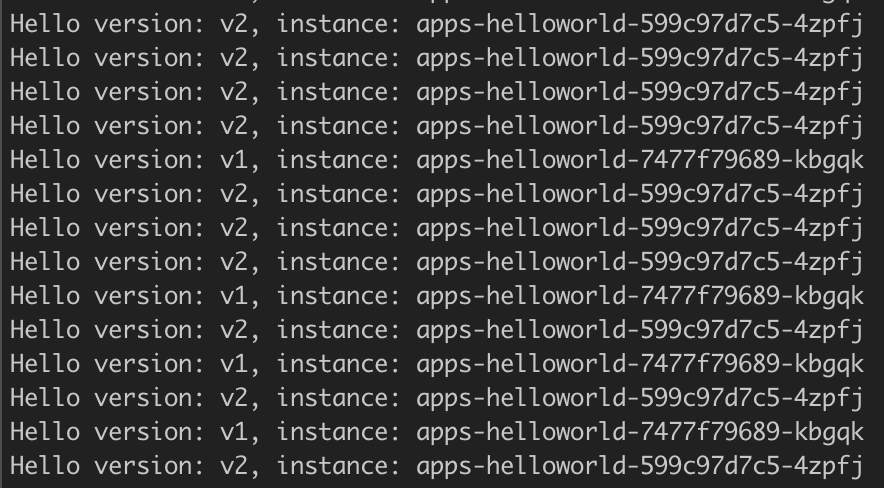
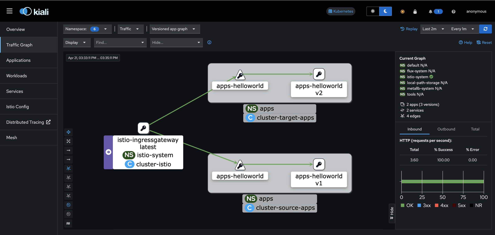
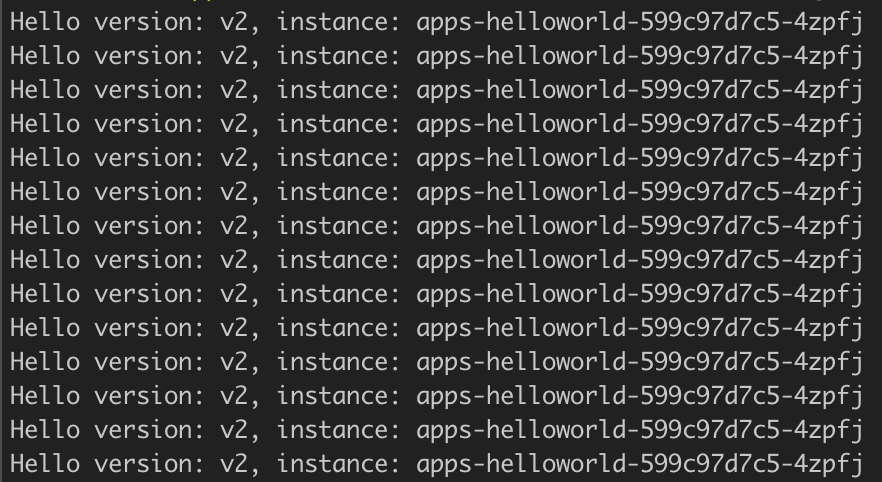
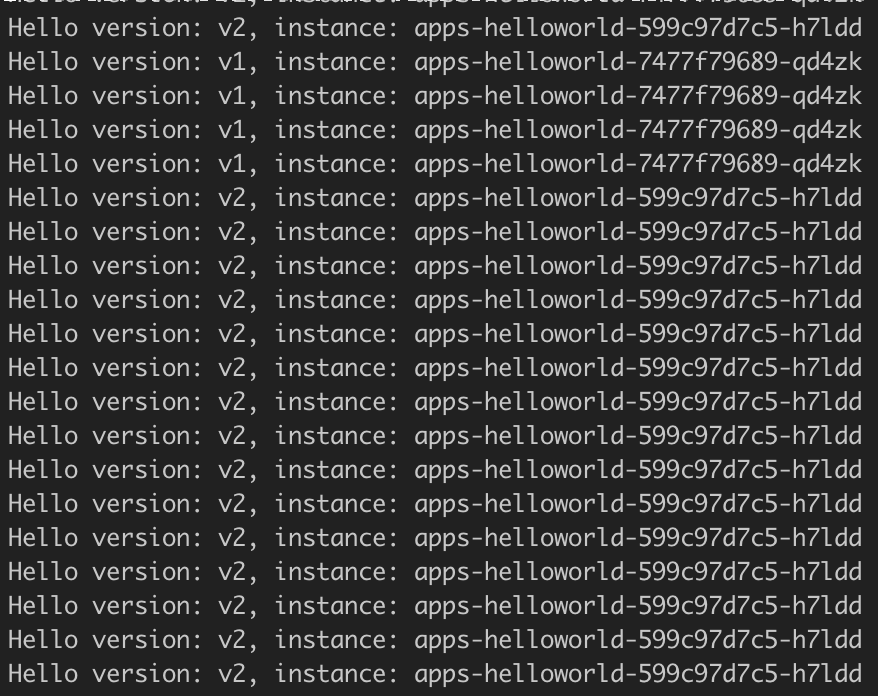
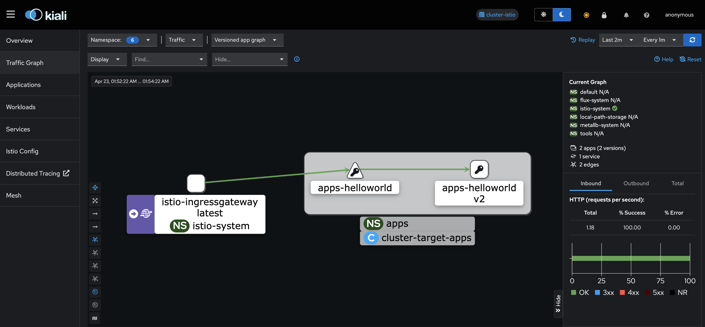
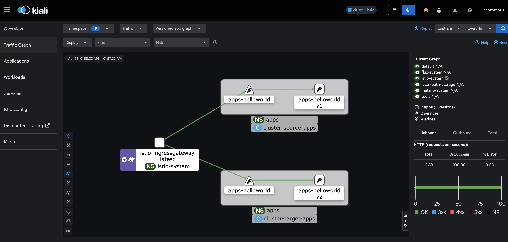

## Summary

This project provision 3 kind clusters, istio, source-apps and target-apps. The cluster istio will be responsible for handle the traffic and Istio ingress gateway resources and the other clusters will be running the application helloworld, beeing cluster source-apps with version V1 and target-apps with V2.

The communication between them are made by Istio multi cluster multi primary with different network, and except by the actions on startup.sh, the whole resources are created by Flux.

## Network Architecture draw


## Requirements

**Binaries installed**
- flux
- istioctl
- kind
- kubectl
- make

## Initial Setup
1. **Setup the environment**:
   - Create a fork for this repository
   - Create or reutilize your Github Personal Access Token(PAT), follow doc: https://docs.github.com/en/authentication/keeping-your-account-and-data-secure/managing-your-personal-access-tokens
   - Adjust the command of variable 'ip' on script startup.sh to your setup, It should return only IP, like '192.168.15.2'. Note that is already configured for MacOS.
   - Check if your system have installed the following binaries: kind, kubectl, make, istioctl and flux.
   - Export your github username and PAT through the command bellow:
        ```bash
        export GITHUB_USER=your-github-username-here
        export GITHUB_TOKEN=your-github-pat-here
        ```


2. **Execute the startup script**:
    - The script will create the kind clusters istio, source-apps and target-apps. Create certificates to each of them to be used for Istio communication, inittiate the Flux bootstrap to folder gitops and create the crossed istio secrets.
    
    - In the root path of the repository, run the command bellow:
        ```bash
        ./startup.sh -u $GITHUB_USER -t $GITHUB_TOKEN
        ```


3. **Check resources creation**:
    - Wait until Flux run the conciliation to kustomization resources be ready, you can run the commands bellow:
        ```bash
        kubectl get kustomization -n flux-system --context=kind-istio
        kubectl get kustomization -n flux-system --context=kind-source-apps
        kubectl get kustomization -n flux-system --context=kind-target-apps
        ```

    - Check if all pods are available as well:
        ```bash
        kubectl get pods -A --context=kind-istio
        kubectl get pods -A --context=kind-source-apps
        kubectl get pods -A --context=kind-target-apps
        ```


4. **Port forward to Kiali monitoring and Istio ingress gateway**:
    - Execute port-forward to Istio ingress gateway service to serve local on port 8080:
        ```bash
        kubectl port-forward service/istio-ingressgateway -n istio-system --context=kind-istio 8080:80 &
        ```

    - Execute port-forward to Kiali service to serve local on port 20001:
        ```bash
        kubectl port-forward service/kiali -n istio-system --context=kind-istio 20001:20001 &
        ```

5. **Generate traffic**:
    - Check the Helloworld app version running on cluster source-apps:
        ```bash
        kubectl get deploy apps-helloworld -n apps -o jsonpath='{.spec.template.spec.containers[0].image}' --context=kind-source-apps
        ```

    - Check the Helloworld app version running on cluster target-apps
        ```bash
        kubectl get deploy apps-helloworld -n apps -o jsonpath='{.spec.template.spec.containers[0].image}' --context=kind-target-apps
        ```
    - The cluster source-apps is running helloworld *V1* and cluster target-apps *V2*
    - Open another terminal session to generate the traffic
    - Generate traffic to helloworld through the ingress gateway
    - Run the command bellow
        ```bash
        for x in {0..100}; do curl -H 'Host: helloworld.batatinha.com' http://127.0.0.1:8080/hello; done
        ```
    
    - Checking the output from the command above, It's returning both versions of helloworld in each cluster
        


6. **Access the Kiali monitoring**:
    - In your browser, access the URL: http://localhost:20001/
    - Click on menu tab "Traffic Graph"
    - Select namespace "select all"
    - You will be able to see the following graph:
        

    - As you can see, there are traffic from cluster istio to helloworld in both clusters source-apps and target-apps


7. **Scale down helloworld on cluster source-apps**:
    - Change helloworld V1 on cluster source-apps to 0 replicas
        ```bash
        kubectl scale deployment apps-helloworld -n apps --context=kind-source-apps --replicas=0
        ```

    - Generate traffic again to update de Kiali graph
        ```bash
        for x in {0..500}; do curl -H 'Host: helloworld.batatinha.com' http://127.0.0.1:8080/hello; done
        ```

    - Until the flux reconcile the replicas, the output of that test will return only V2 version, which is running on cluster target-apps
        


8. **Remove cluster source-apps from the istio route**:
    - Let generating traffic again in another session to follow the changes is live
        ```bash
        for x in {0..1500}; do curl -H 'Host: helloworld.batatinha.com' http://127.0.0.1:8080/hello; done
        ```

    - Check the secrets created on cluster istio
        ```bash
        kubectl get secret -n istio-system --context=kind-istio
        ```

    - Delete the secret referred to cluster source-apps
        ```bash
        kubectl delete secret istio-remote-secret-source-apps -n istio-system --context=kind-istio
        ```

    - Check the session where the traffic is running, you should se only version V2 of helloworld without errors
        
    
    - Wait a minute e check the Kiali traffic graph, It should appear only cluster target-apps
        

    - If rollback is necessary, you can recreate the secret using Istioctl with command bellow
        ```bash
        istioctl create-remote-secret --name=source-apps --context=kind-source-apps | kubectl apply --context=kind-istio -f -
        ```

    - And then, cluster source-apps receive the traffic again
    

9. **Cleanup**:
    - Execute the clean up script
        ```bash
        ./cleanup.sh
        ```
